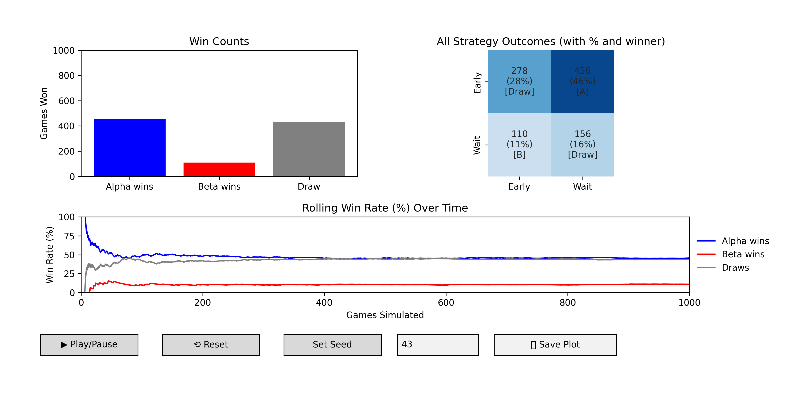
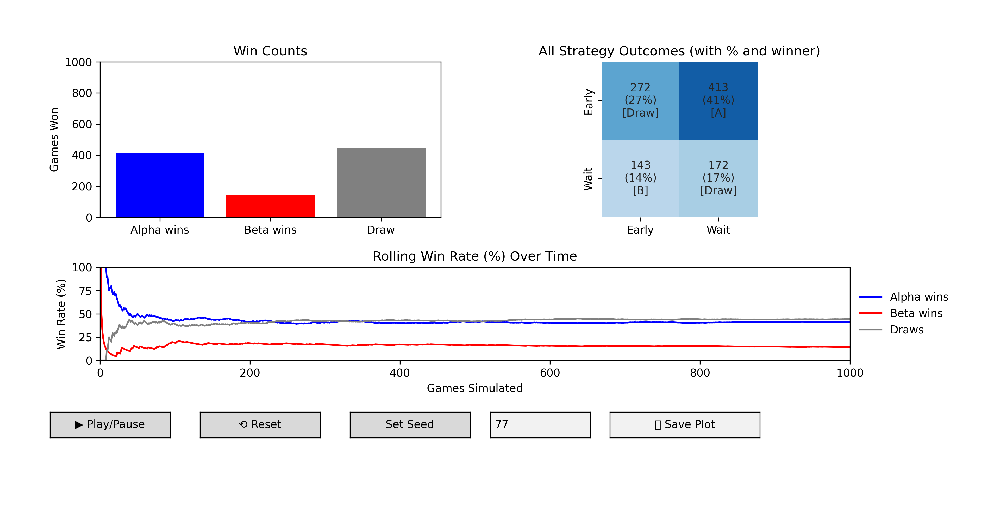
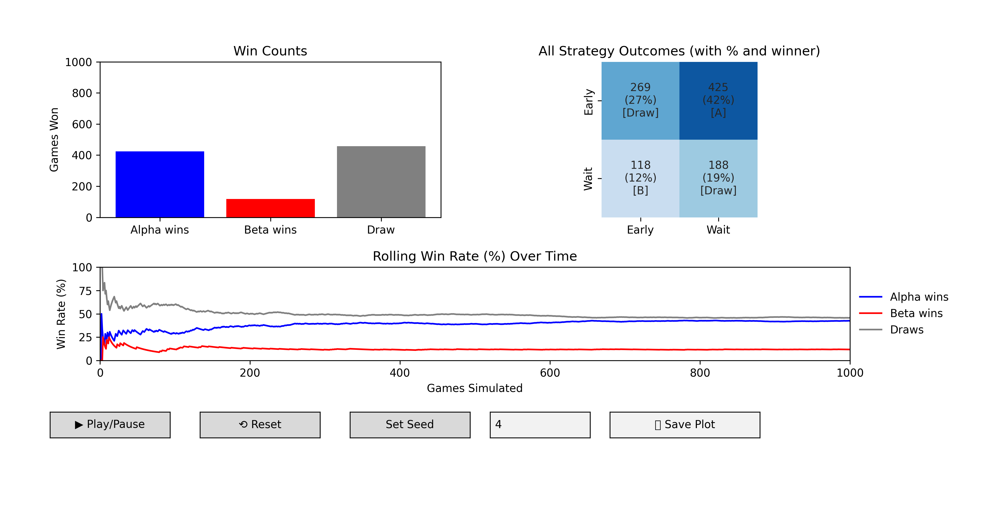
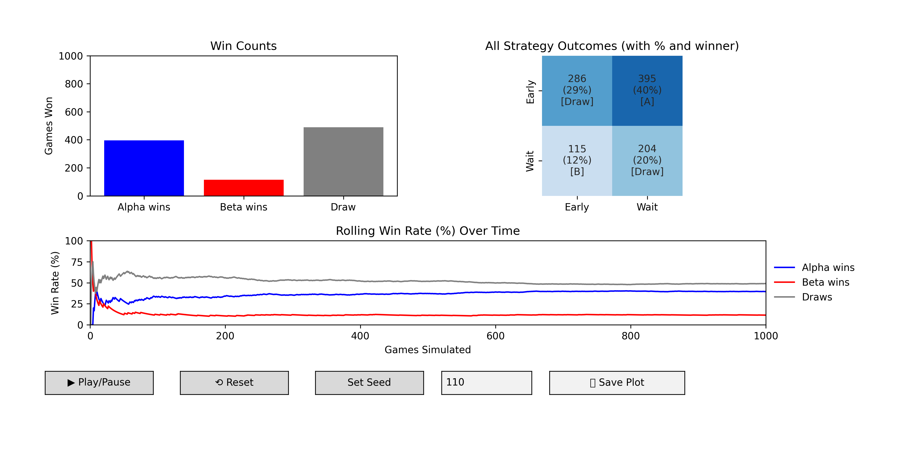

# 🎲 Game Theory Simulator: Asymmetric Repeated Coordination Game

This Python-based simulation explores a **repeated strategic interaction** between two players — **Alpha** and **Beta** — who must each choose between two strategies: `"Early"` or `"Wait"`. The outcomes are determined by an asymmetric **payoff matrix**, and the system visualizes live adaptations and statistical patterns as the game unfolds over time.

This Python simulation models a repeated strategic interaction between two competing tech companies, AlphaTech and BetaCorp, each deciding whether to launch a new smart home device early or delay entry to gather more market insights. The asymmetric payoff matrix captures the trade-offs: launching early may capture market share and establish brand leadership but involves higher risks and costs, while waiting allows learning and risk reduction but risks losing the first-mover advantage.

This tool dynamically visualizes the evolving competitive landscape, showing how different timing strategies impact market dominance, win rates, and coordination outcomes over time. It offers a valuable framework for understanding strategic timing decisions in fast-moving technology markets.

---

## 🎯 Game Overview

This simulation models a classic **coordination game with asymmetric payoffs**, where:

- Players repeatedly choose strategies without observing the other's current choice.
- Payoffs are higher when coordinating **at the right time**, but incentives differ:
  - **Alpha** benefits more by acting **early**.
  - **Beta** is better off by **waiting**, unless coordination fails.
- Players act stochastically based on preset strategy weights (adjustable).

---

## 🔢 Payoff Matrix

|               | Beta: Early | Beta: Wait |
|---------------|-------------|------------|
| **Alpha: Early** | (3, 3)     | (5, 1)     |
| **Alpha: Wait**  | (1, 5)     | (4, 4)     |

Each cell shows the payoffs as `(Alpha payoff, Beta payoff)`.  
Mutual waiting yields moderate stability, but miscoordination favors one party—typical of asymmetric coordination challenges.

---

## 📊 Simulation Features

- 🎬 **Live Simulation:** Real-time rendering of outcomes over up to 1,000 repeated games.
- 🔁 **Play/Pause + Reset:** Control the simulation flow.
- 🎲 **Seed Control:** Set custom seeds for reproducibility or randomness.
- 🌡️ **Heatmap of Strategy Outcomes:** Tracks frequency, win percentage, and dominant player per strategy pair.
- 📈 **Rolling Win Rate Chart:** Dynamic evolution of success rates for Alpha, Beta, and draws.
- 📤 **Export to PNG:** Save the current dashboard view as an image.
- 📋 **Summary Statistics Output:** Includes total games, win percentages, and dominant strategies.

---

## 🧪 Example Output

=== Simulation Summary ===

Total Games: 1000

Alpha wins: 411 games (41.1%)

Beta wins: 127 games (12.7%)

Draw: 462 games (46.2%)

Most common strategy pair: ('Early', 'Wait') -> 411 times

---

## 💡 Use Case

This simulation helps illustrate strategic timing decisions for businesses facing **first-mover advantages** and **market entry risks**. It’s especially applicable for tech companies launching new products where being early can capture market share but involves uncertainty, while waiting mitigates risks but risks falling behind.

---

